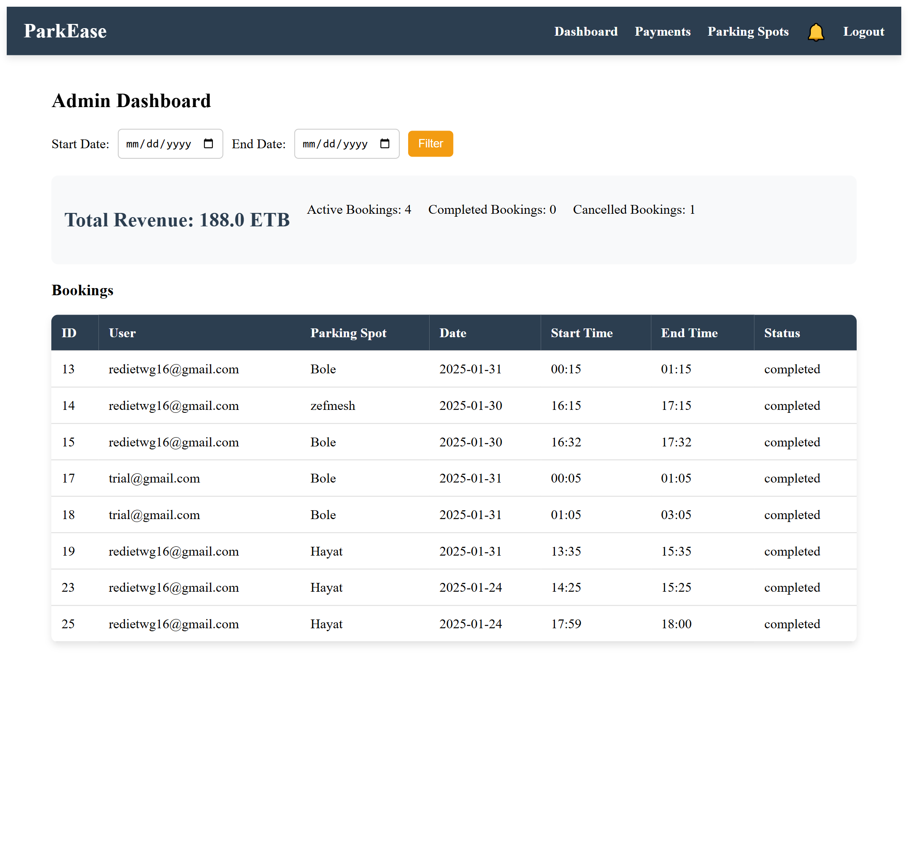
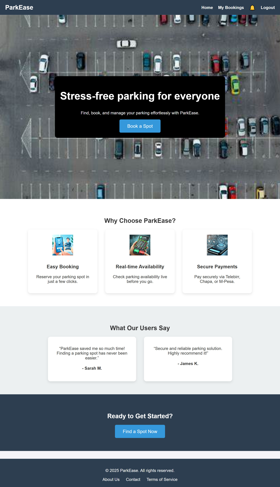
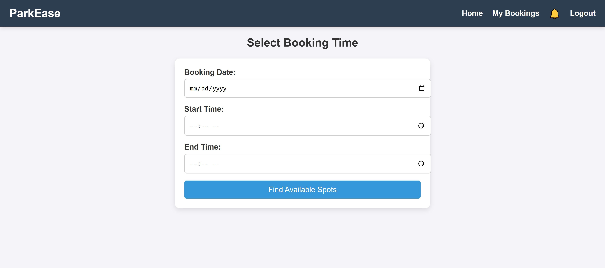
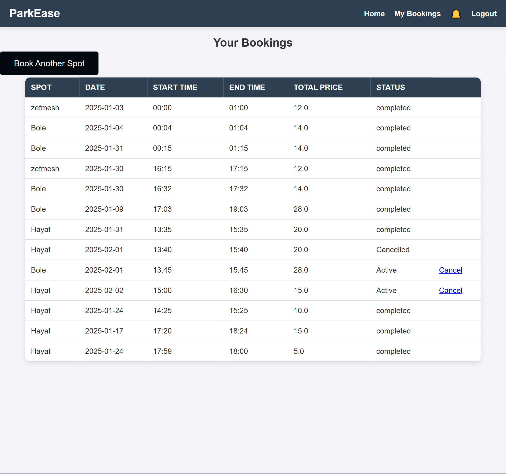
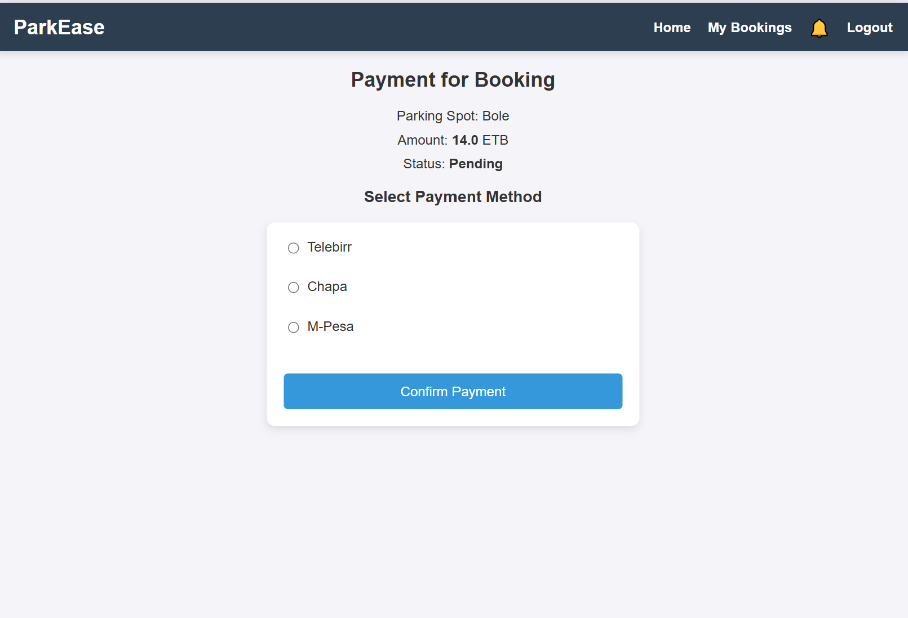
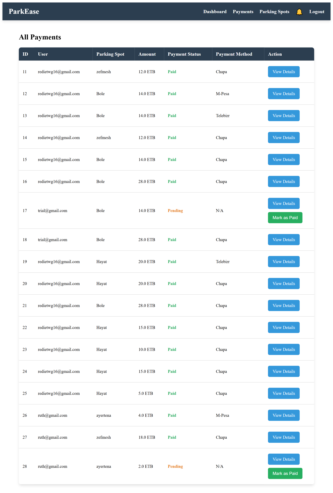
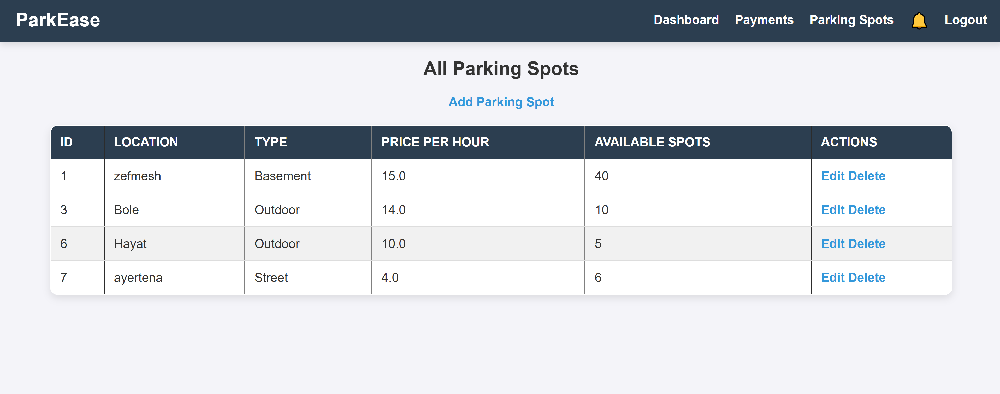

# ParkEase: Parking Management System

## By: Rediet Woudma UGR/4779/14

## Problem Statement

In Ethiopia, finding parking spaces in cities like Addis Ababa is a daily struggle. Drivers waste time and fuel searching for a spot, leading to:

- Traffic congestion
- Wasted fuel and increased emissions
- Frustrated drivers and inefficiency

Many existing parking areas lack real-time tracking and reservation systems, forcing people to physically check for availability.

## Our Solution: ParkEase

**ParkEase** is a smart parking management system that allows users to:

- Find available parking spots in real time
- Reserve and book slots in advance
- Receive notifications about parking updates
- Ensure a seamless parking experience with minimal effort

---

## Features

### User Features

- **Sign up & Login** – Secure authentication for users.
- **Search Parking Spaces** – View available spots in real time.
- **Book a Parking Spot** – Reserve a slot before arriving.
- **View My Bookings** – Track current and past reservations.
- **Receive Notifications** – Get alerts on slot availability, bookings, and payment status.
- **Secure Payments** – Seamless payment for reserved spots.
- **Logout** – Securely exit the platform.

### Admin Features

- **Manage Parking Slots** – Add, update, and remove parking spaces.
- **View User Bookings** – Monitor and manage user reservations.
- **Send Notifications** – Alert users about slot availability.

---

## Screenshots

**Login Page**  


**Dashboard**  


**Parking Search & Booking**  


**User Bookings**  



**Admin Panel**  




---

## Tech Stack

- **Spring Boot** – Backend API
- **Thymeleaf** – Server-side rendering
- **MySQL** – Database
- **Spring Security** – Authentication
- **CSS** – Frontend styling
- **REST APIs** – Seamless data exchange

---

## Setup Instructions

1. **Clone the repository**
   ```
   git clone https://github.com/Rediet-W/EAD-LAB-Works
   cd ParkEase
   ```
2. Configure the database (MySQL)
3. Run the Spring Boot server

```mvn spring-boot:run

```
